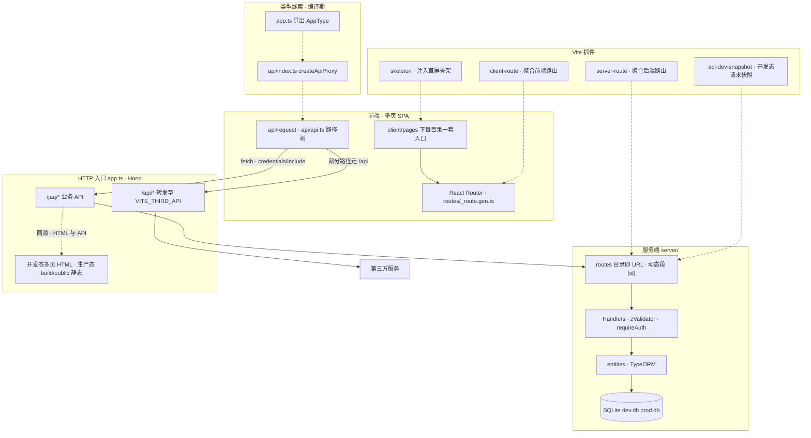

# Fullstack App

基于 **Vite + Hono + React** 的一体化全栈应用：单仓库内完成多页面前端、类型友好的 HTTP 客户端与文件式后端路由，开发时由 Vite 统一启动，生产构建为单一 Node 进程 + 静态资源。

---

## 技术栈

| 层级 | 选型 |
|------|------|
| 构建与开发服务器 | Vite 7、`@hono/vite-dev-server`、`@hono/vite-build` |
| 后端框架 | Hono 4、Node（`@hono/node-server`） |
| 校验 | Zod、`@hono/zod-validator`（项目内封装统一错误体） |
| 数据访问 | TypeORM、SQLite（`dev.db` / `prod.db`） |
| 前端 UI | React 18、Ant Design 6、antd-style |
| 路由 | React Router 7（多页各自独立路由表） |
| 数据请求 | 原生 `fetch` + 链式 `request` 代理（类型与 Hono 路由对齐） |
| 异步状态 | TanStack Query 5 |

---

## 项目架构

### 总体结构



**读图说明**

- **纵向**：浏览器中的页面通过 `request` / `Fetch` 访问同源 `app.ts`；`/jaq` 进入文件路由与数据库，`/api` 穿出到配置的外部地址。
- **GW1 ↔ GW3**：同一 `app.ts` 进程内，多页 HTML（开发）与 `build/public` 静态（生产）与业务 API 同源。
- **虚线**：`server-route` / `client-route` 根据目录生成 `_route.gen.ts`（勿手改）；`api-dev-snapshot` 在开发时监听 `server/routes` 并落盘快照；`skeleton` 在构建 HTML 时注入骨架；`AppType` 将 Hono 应用类型接到 `request`。
- **开发**：`@hono/vite-dev-server` 以 `app.ts` 为入口；**构建**：`mode=client` 产出静态资源，`mode=server` 产出 `build/app.js`。

### 目录说明

| 路径 | 作用 |
|------|------|
| `app.ts` | HTTP 入口：路由、静态页、代理、重定向 |
| `server/routes/` | 文件即路由；`[id].ts` 动态段；**勿编辑** `_route.gen.ts` |
| `server/entities/` | TypeORM 实体 |
| `server/utils/` | 鉴权、Zod 封装等 |
| `api/` | `request` 代理、`api.ts` 路径树、`Fetch` 底层请求 |
| `client/pages/<page>/` | 每页独立 `index.html`、`main.tsx`、懒加载路由 |
| `types/`、`utils/` | 共享类型与工具 |

### 接口约定

- **自建后端**：统一前缀 **`/jaq`**（与 `vite-plugin-server-route` 的 `baseRoute` 一致）。
- **第三方 / 网关**：路径 **`/api/*`**，由 `app.ts` 转发到环境变量 `VITE_THIRD_API`。
- 前端通过 **`import { request } from 'api'`** 链式调用，例如 `request.jaq.auth.me.get()`；路径与 `api/api.ts` 中声明的字符串保持一致。

### Vite 插件

| 插件 | 作用 |
|------|------|
| **vite-plugin-server-route** | 扫描 `server/routes`，按文件路径与导出的 `GET`/`POST`/… 生成 `server/routes/_route.gen.ts`，并挂到 `basePath`（如 `/jaq`）。监听文件变更并热更新。 |
| **vite-plugin-client-route** | 扫描各 `client/pages/<应用>/routes/`，生成懒加载的 `routes/_route.gen.ts`，并合并同路径下 `*.config.tsx` 的 `meta` / `loader` 等。 |
| **vite-plugin-api-dev-snapshot** | **仅开发模式**（`apply: 'serve'`）。监听 `server/routes` 下路由或 `*.resolver.ts`（快照配置）变更，按 `defineDevSnapshot`（`server/dev-snapshot/define.ts`）配置对本机 dev server 发起真实 HTTP 请求，将各方法的 **request / response** 写入与路由同名的 **`*.resolver.json`**（便于联调对照、文档与回归）。支持 `asUser` 按用户名签发开发用 Cookie。可通过环境变量 **`VITE_API_DEV_SNAPSHOT=0`**（或 `false`）关闭。`*.resolver.ts`（快照配置）不参与 `_route.gen` 聚合。 |
| **vite-plugin-skeleton** | 在 `transformIndexHtml` 阶段按页面名调用 `get-skeleton-code.mts`，把生成的 **骨架屏 HTML/CSS** 注入 `compileHtml`，与 `Suspense` 占位配合；`mode=client` 构建结束时还会把 `build/public/client/pages/<page>/index.html` 扁平化为 `build/public/<page>.html` 并清理中间目录。 |

---

## 框架与设计优势

1. **单仓库、单开发命令**  
   前端静态资源与 Hono 应用在同一 Vite 工程内，无需单独起两个仓库或手动对齐端口。

2. **文件即路由，前后端路径可对照**  
   `server/routes` 下的目录结构即 URL 结构；配合 `api/api.ts` 的嵌套路径，新增接口时心智负担小。

3. **端到端类型线索**  
   `api/index.ts` 使用 `app.ts` 导出的 `AppType`，让 `request` 的链式调用与 Hono 路由在类型层面关联（在完善 Schema 的前提下可进一步收紧类型）。

4. **多页面前端**  
   `client/pages` 下每个子目录是一套独立 SPA，适合后台（cms）、登录页、404 等场景隔离打包与路由。

5. **轻量后端与本地数据**  
   Hono 体积小、中间件模型清晰；SQLite + TypeORM 便于本地与小型部署，无需单独起数据库服务。

6. **校验与错误格式统一**  
   `server/utils/zod-validator` 将 Zod 失败转为 `{ message, issues }`，便于前端直接展示。

---

## 环境要求

- Node.js（建议 LTS）
- 包管理：**pnpm**

项目通过 Vite 加载环境变量，根目录按需配置 **`.env.development`**、**`.env.production`** 等（与 `app.ts` 中 `dotenv` 的加载逻辑一致）。常见变量包括：

- `VITE_PORT`：开发服务器端口  
- `VITE_THIRD_API`：`/api/*` 代理目标  
- `VITE_API_DEV_SNAPSHOT`：设为 `0` 或 `false` 时关闭 **api-dev-snapshot** 插件（默认开启）  
- `mode`：Node 生产启动时区分环境（见 `package.json` 的 `start:test` / `start:prod`）

---

## 常用脚本

| 命令 | 说明 |
|------|------|
| `pnpm install` | 安装依赖 |
| `pnpm dev` | 本地开发（Vite + Hono dev server） |
| `pnpm build` | 构建客户端静态资源 + 服务端 `build/app.js` |
| `pnpm start:test` | 使用构建产物启动（测试模式） |
| `pnpm start:prod` | 使用构建产物启动（生产模式） |

---

## 快速开始

### 本地开发

```bash
pnpm install
pnpm dev
```

按需复制并填写环境变量文件后启动；浏览器访问对应页面（如 `/cms` 等，以 `app.ts` 中路由为准）。

### Node 部署

```bash
pnpm install
pnpm build

# 测试环境
pnpm start:test

# 生产环境
pnpm start:prod
```

### Docker 部署

```bash
# 测试环境
./deploy.sh test

# 生产环境
./deploy.sh prod

# 停止所有容器
./deploy.sh stop

# 重启所有容器
./deploy.sh restart

# 查看帮助
./deploy.sh help
```

---

## 更多说明

- 服务端路由与客户端路由表中的 **`_route.gen.ts` 均为插件生成，请勿手动修改**；改文件后保存会触发重新生成。
- Cursor 规则与约定说明见项目内 **`.cursor/rules/`**（若已启用）。
